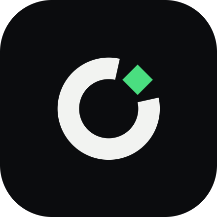

<p align="center">
  
</p>

<h1 align="center">OpenProvider</h1>

<p align="center">
one agent. every provider. free.
</p>

<div align="center">
<table>
<tbody>
<td align="center">
<a href="https://github.com/Albis0/OpenProvider" target="_blank"><strong>Repository</strong></a>
</td>
<td align="center">
<a href="https://github.com/Albis0/OpenProvider/issues" target="_blank"><strong>Issues</strong></a>
</td>
</tbody>
</table>
</div>

---

## What this is

OpenProvider is a fork of [Cline](https://github.com/cline/cline), a VS Code coding agent, focused on **free API providers**: NVIDIA Build, Groq, Cerebras, Gemini, and OpenRouter. It creates and edits files, runs terminal commands, uses the browser, and extends itself through MCP — all with your approval before anything changes in your workspace.

This fork removes the parts of Cline that depend on Cline's own hosted account, billing, and telemetry backend, since this project doesn't run that infrastructure.

## Why

Most coding agents assume a single paid API in the background. OpenProvider is built around free-tier providers instead, so cost isn't the reason you can't try it. The project's direction is toward:

- **Live quota visibility** — see how much of a provider's free quota is left, right in the sidebar.
- **Ask before switching** — when a provider is rate-limited, you decide whether to switch, not the agent.
- **Same model, different provider** — a clear UI distinction between switching models and switching who's hosting the same model.

These are direction, not shipped features yet.

## Getting started

Not on the VS Code Marketplace yet. Build the extension and install it locally:

```bash
bun install
bun run build:sdk

cd apps/vscode
cp .env.example .env
bun run protos
bun run build:webview
bun esbuild.mjs
bunx vsce package --no-dependencies --out ../../openprovider.vsix

code --install-extension ../../openprovider.vsix --force
```

Reload the window, then click the OpenProvider icon in the activity bar — the chat opens in the secondary (right) side bar.

You will need an API key from one of the supported free-tier providers: [Groq](https://console.groq.com), [Cerebras](https://cloud.cerebras.ai), [Gemini](https://aistudio.google.com/apikey) or [OpenRouter](https://openrouter.ai/keys). Pick **Bring my own API key** during onboarding and paste it in.

NVIDIA Build is listed as a goal but is not wired into the extension yet.

Requires VS Code 1.106 or newer.

## Contributing

See [CONTRIBUTING.md](CONTRIBUTING.md) for the development setup, and [`docs/fork/REPO-MAP.md`](docs/fork/REPO-MAP.md) for a map of the codebase: where providers are defined, what to touch to add one, and where the sidebar UI lives.

## License

[Apache 2.0](./LICENSE). See [NOTICE](./NOTICE) — this project is derived from [Cline](https://github.com/cline/cline) (Apache-2.0) and has been modified.
