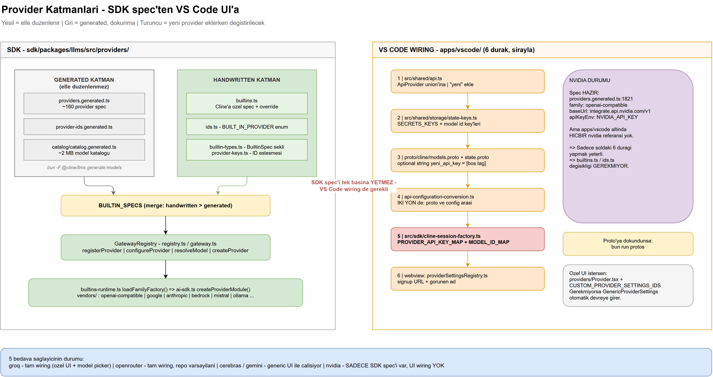
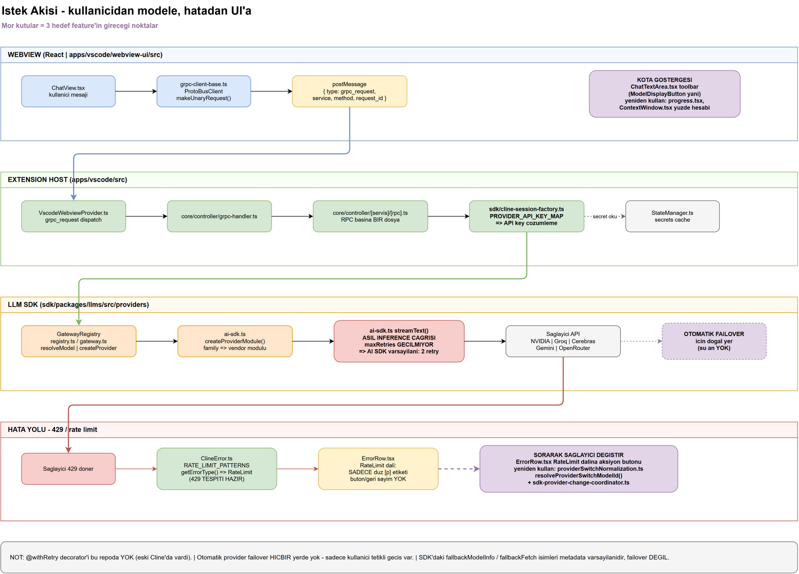

# Cline Repo Haritası — Fork Geliştirme Rehberi

Bu doküman, bedava API sağlayıcılarına (NVIDIA Build, Groq, Cerebras, Gemini, OpenRouter) odaklı bir Cline fork'u geliştirmek için hazırlandı. Amaç: "şunu değiştirmek için hangi dosyayı açmalıyım?" sorusunu tek bakışta cevaplamak.

Buradaki tüm dosya yolları `2026-07-27` tarihinde `main` branch'inde doğrulandı.

Diyagramların kaynağı: [architecture.drawio](architecture.drawio) (draw.io ile açılıp düzenlenebilir, 2 sayfa).

### Diyagram 1 — Provider katmanları



### Diyagram 2 — İstek akışı ve hata yolu



---

## 0. Önce bunu oku: bu repo eski Cline değil

Cline hakkında internette bulacağın çoğu rehber **geçersiz**. Bu repo refactor sonrası hâlde:

| İnternette anlatılan (eski) | Bu repoda gerçek durum |
|---|---|
| `src/api/providers/<ad>.ts` handler sınıfı yazarsın | **Böyle bir klasör yok.** Provider'lar deklaratif spec objesi |
| `buildApiHandler()` factory'sine eklersin | **`buildApiHandler` yok.** `GatewayRegistry` + AI SDK family routing var |
| Her provider kendi stream mantığını yazar | Vercel AI SDK'nın `streamText`'i ortak, provider'lar sadece "family"ye maplenir |

`ApiHandler` interface'i [handler.ts](../../sdk/packages/llms/src/providers/handler.ts) hâlâ duruyor ama **artık ana genişleme noktası değil** — sadece runtime escape hatch olarak `factory-registry.ts` üzerinden kullanılıyor.

### İki katmanlı provider modeli

```
┌─────────────────────────────────────────────────────────┐
│  Handwritten katman — builtins.ts                       │  ← elle düzenlenir
│  Cline'a özel spec'ler + generated katmanın override'ı  │
├─────────────────────────────────────────────────────────┤
│  Generated katman — *.generated.ts (~160 provider)      │  ← ELLE DÜZENLENMEZ
│  models.dev'den türetilir, script ile yenilenir         │
└─────────────────────────────────────────────────────────┘
                          ↓ merge
                  BUILTIN_SPECS → GatewayRegistry
```

**Senin ilgilendiğin 5 sağlayıcının hepsi generated katmanda mevcut.** İkisi (groq, openrouter) ayrıca handwritten override'a da sahip.

---

## 1. Provider katmanı — dosya haritası

Hepsi [sdk/packages/llms/src/providers/](../../sdk/packages/llms/src/providers/) altında:

| Dosya | Ne yapar | Elle düzenlenir mi |
|---|---|---|
| [ids.ts](../../sdk/packages/llms/src/providers/ids.ts) | `BUILT_IN_PROVIDER` enum'u, ID alias'ları, `normalizeProviderId()` | ✅ Evet |
| [builtins.ts](../../sdk/packages/llms/src/providers/builtins.ts) | Elle yazılan provider spec'leri; generated'ın üstüne merge edilir | ✅ Evet |
| [builtin-types.ts](../../sdk/packages/llms/src/providers/builtin-types.ts) | `BuiltinSpec` interface'i ve `ProviderFamily` union'ı — yazacağın spec'in şekli | ✅ Evet |
| [builtins-runtime.ts](../../sdk/packages/llms/src/providers/builtins-runtime.ts) | `loadFamilyFactory()` — family → AI SDK factory eşleşmesi | ✅ Evet |
| [registry.ts](../../sdk/packages/llms/src/providers/registry.ts) | `GatewayRegistry` sınıfı: `registerProvider`, `configureProvider`, `resolveModel`, `createProvider` | ✅ Evet |
| [gateway.ts](../../sdk/packages/llms/src/providers/gateway.ts) | `Gateway` interface'i; builtin'leri kaydeder | ✅ Evet |
| [ai-sdk.ts](../../sdk/packages/llms/src/providers/ai-sdk.ts) | `createProviderModule()` switch'i + **asıl `streamText()` çağrısı** | ✅ Evet |
| [provider-keys.ts](../../sdk/packages/llms/src/providers/provider-keys.ts) | `PROVIDER_IDS_MAP` — Cline ID ↔ models.dev key eşleşmesi | ✅ Evet |
| [vendors/](../../sdk/packages/llms/src/providers/vendors/) | Family başına vendor modülü (`openai-compatible.ts`, `google.ts`, `anthropic.ts`, …) | ✅ Evet |
| [providers.generated.ts](../../sdk/packages/llms/src/providers/providers.generated.ts) | ~160 provider spec'i | ❌ **Hayır** |
| [provider-ids.generated.ts](../../sdk/packages/llms/src/providers/provider-ids.generated.ts) | Generated ID listesi | ❌ **Hayır** |
| [catalog/catalog.generated.ts](../../sdk/packages/llms/src/catalog/catalog.generated.ts) | ~2 MB model kataloğu | ❌ **Hayır** |

Generated dosyaları yenilemek için:
```bash
bun -F @cline/llms generate:models
```

### Senin 5 sağlayıcın nerede

| Sağlayıcı | Spec konumu | VS Code'da seçilebilir mi |
|---|---|---|
| **groq** | [builtins.ts](../../sdk/packages/llms/src/providers/builtins.ts) (~satır 673) + generated | ✅ Tam wiring — kendi UI komponenti ve model picker'ı var |
| **cerebras** | [builtins.ts](../../sdk/packages/llms/src/providers/builtins.ts) (~satır 682) | ✅ Generic UI ile |
| **gemini** | [builtins.ts](../../sdk/packages/llms/src/providers/builtins.ts) (~satır 989), `family: "google"` | ✅ Generic UI ile; API key'i vertex ile paylaşıyor |
| **openrouter** | [builtins.ts](../../sdk/packages/llms/src/providers/builtins.ts) (~satır 849) | ✅ Tam wiring + **repo'nun varsayılan sağlayıcısı** |
| **nvidia** | [providers.generated.ts:1821](../../sdk/packages/llms/src/providers/providers.generated.ts#L1821) | ❌ **Hayır — bkz. Bölüm 3** |

---

## 2. Yeni sağlayıcı eklemek

İki ayrı iş var ve **ikisi de gerekli**: (A) SDK tarafı spec, (B) VS Code tarafı wiring. Sadece A'yı yapmak yetmez — nvidia'nın durumu tam olarak bu.

### A) SDK tarafı

**Senaryo A1 — models.dev'de zaten var ve desteklenen bir `@ai-sdk/*` paketi kullanıyor** (en kolay):
1. [provider-keys.ts](../../sdk/packages/llms/src/providers/provider-keys.ts) → Cline ID'si models.dev key'inden farklıysa `PROVIDER_IDS_MAP`'e satır ekle. `MODELS_DEV_BLOCKED_PROVIDER_IDS` listesinde olmadığından emin ol.
2. [catalog-live.ts](../../sdk/packages/llms/src/catalog/catalog-live.ts) → `MODELS_DEV_AI_SDK_PROVIDER_FAMILIES` içinde ilgili npm paketi bulunmalı.
3. `bun -F @cline/llms generate:models` çalıştır.

**Senaryo A2 — tamamen özel sağlayıcı:**
1. [builtins.ts](../../sdk/packages/llms/src/providers/builtins.ts) → `OPENAI_COMPATIBLE_SPEC_OVERRIDES` veya `BUILTIN_SPEC_OVERRIDES` içine bir `BuiltinSpec` ekle.
2. [ids.ts](../../sdk/packages/llms/src/providers/ids.ts) → `BUILT_IN_PROVIDER` enum'una ekle.
3. Yeni bir *family* gerekiyorsa (nadir): [builtin-types.ts](../../sdk/packages/llms/src/providers/builtin-types.ts) `ProviderFamily` + [builtins-runtime.ts](../../sdk/packages/llms/src/providers/builtins-runtime.ts) switch + [ai-sdk.ts](../../sdk/packages/llms/src/providers/ai-sdk.ts) `createProviderModule` switch + yeni `vendors/<ad>.ts`.

Çoğu bedava sağlayıcı OpenAI-uyumlu endpoint sunuyor → `family: "openai-compatible"` yeterli, yeni vendor modülü yazmana gerek yok.

### B) VS Code tarafı wiring — 6 durak

Bu zincir sırayla takip edilmeli; biri eksikse sağlayıcı UI'da görünmez ya da API key'i okunmaz:

| # | Dosya | Ne eklenecek |
|---|---|---|
| 1 | [src/shared/api.ts](../../apps/vscode/src/shared/api.ts) | `ApiProvider` union'ına `\| "<ad>"` |
| 2 | [src/shared/storage/state-keys.ts](../../apps/vscode/src/shared/storage/state-keys.ts) | `SECRETS_KEYS`'e `<ad>ApiKey`; istersen `planMode<Ad>ModelId` / `actMode<Ad>ModelId` |
| 3 | [proto/cline/models.proto](../../apps/vscode/proto/cline/models.proto) + [state.proto](../../apps/vscode/proto/cline/state.proto) | `optional string <ad>_api_key = <boş tag>` — **models.proto'da hem `ApiConfiguration` hem `ModelsApiConfiguration` mesajına** |
| 4 | [api-configuration-conversion.ts](../../apps/vscode/src/shared/proto-conversions/models/api-configuration-conversion.ts) | **İki yön de** — proto→config ve config→proto |
| 5 | **[src/sdk/cline-session-factory.ts](../../apps/vscode/src/sdk/cline-session-factory.ts)** | `PROVIDER_API_KEY_MAP` ve `PROVIDER_MODEL_ID_MAP` — **extension tarafındaki en kritik edit** |
| 6 | [providerSettingsRegistry.ts](../../apps/vscode/webview-ui/src/components/settings/providers/providerSettingsRegistry.ts) | `GENERIC_PROVIDER_PRESENTATION_OVERRIDES` (signup URL) + `FALLBACK_GENERIC_PROVIDER_NAMES` (görünen ad) |

Proto'ya dokundunsa `bun run protos` çalıştırmayı unutma.

**Özel UI istersen** (Groq gibi): `webview-ui/src/components/settings/providers/<Ad>Provider.tsx` yaz, `CUSTOM_PROVIDER_SETTINGS_IDS`'e ekle, [ApiOptions.tsx](../../apps/vscode/webview-ui/src/components/settings/ApiOptions.tsx)'te koşullu render et. Gerekmiyorsa `GenericProviderSettings.tsx` otomatik devreye girer.

**Dinamik model listesi istersen**: `src/core/controller/models/refresh<Ad>Models.ts` — [refreshGroqModels.ts](../../apps/vscode/src/core/controller/models/) ve `refreshOpenRouterModels.ts` örnek alınabilir.

---

## 3. NVIDIA Build — hazır checklist

NVIDIA spec'i [providers.generated.ts:1821-1839](../../sdk/packages/llms/src/providers/providers.generated.ts#L1821)'da **zaten var**:

```json
{ "id": "nvidia", "name": "Nvidia", "family": "openai-compatible",
  "capabilities": ["tools", "reasoning", "prompt-cache"],
  "defaultModelId": "z-ai/glm-5.2",
  "apiKeyEnv": ["NVIDIA_API_KEY"],
  "defaults": { "baseUrl": "https://integrate.api.nvidia.com/v1" } }
```

Ama `apps/vscode/` altında **hiçbir `nvidia` referansı yok** (doğrulandı). Yani SDK biliyor, VS Code UI'ı bilmiyor.

**Yapılacaklar — sadece Bölüm 2B'deki 6 durak.** `builtins.ts` ve `ids.ts` değişikliği **gerekmiyor**; generated katman spec'i, model listesini ve `openai-compatible` runtime routing'ini zaten sağlıyor.

Webview registry girdisi şöyle olmalı:
```ts
// GENERIC_PROVIDER_PRESENTATION_OVERRIDES içine
nvidia: { signupUrl: "https://build.nvidia.com/" },
// FALLBACK_GENERIC_PROVIDER_NAMES içine
nvidia: "NVIDIA",
```

Bu, fork'un ilk somut feature'ı için en düşük riskli başlangıç noktası.

---

## 4. Sidebar UI

Kök: [apps/vscode/webview-ui/src/](../../apps/vscode/webview-ui/src/) — Vite + React 18 + Tailwind.

| Ne | Nerede |
|---|---|
| Giriş noktası | [main.tsx](../../apps/vscode/webview-ui/src/main.tsx) → [App.tsx](../../apps/vscode/webview-ui/src/App.tsx) (düz view switcher) |
| Sohbet ekranı | [ChatView.tsx](../../apps/vscode/webview-ui/src/components/chat/ChatView.tsx) + `chat-view/` alt klasörü |
| Composer (input + toolbar) | [ChatTextArea.tsx](../../apps/vscode/webview-ui/src/components/chat/ChatTextArea.tsx) |
| Görev başlığı / maliyet rozeti | [task-header/TaskHeader.tsx](../../apps/vscode/webview-ui/src/components/chat/task-header/TaskHeader.tsx) |
| Context window göstergesi | [task-header/ContextWindow.tsx](../../apps/vscode/webview-ui/src/components/chat/task-header/ContextWindow.tsx) |
| Ayarlar | [SettingsView.tsx](../../apps/vscode/webview-ui/src/components/settings/SettingsView.tsx) |
| Sağlayıcı seçici | [ApiOptions.tsx](../../apps/vscode/webview-ui/src/components/settings/ApiOptions.tsx) |
| Sağlayıcı listesi verisi | [useProviderListings.ts](../../apps/vscode/webview-ui/src/hooks/useProviderListings.ts) → `ModelsServiceClient.listProviders` → [listProviders.ts](../../apps/vscode/src/core/controller/models/listProviders.ts) |
| Hata satırı | [ErrorRow.tsx](../../apps/vscode/webview-ui/src/components/chat/ErrorRow.tsx) |
| Progress bar primitive | [ui/progress.tsx](../../apps/vscode/webview-ui/src/components/ui/progress.tsx) |

**Kota göstergesi için üç aday nokta** (uygunluk sırasına göre):
1. **[ChatTextArea.tsx](../../apps/vscode/webview-ui/src/components/chat/ChatTextArea.tsx) composer toolbar'ı** — `ModelDisplayButton`'ın yanı. En küçük diff, her zaman görünür.
2. **[TaskHeader.tsx](../../apps/vscode/webview-ui/src/components/chat/task-header/TaskHeader.tsx)** `price-tag` rozetinin yanı — ama sadece aktif görev varken görünür.
3. **[account/CreditBalance.tsx](../../apps/vscode/webview-ui/src/components/account/CreditBalance.tsx)** — hesap seviyesi, sidebar'da sürekli değil.

---

## 5. Webview ↔ Extension iletişimi

`postMessage` üzerinde protobuf zarfları. **Gerçek gRPC değil** — "ProtoBus" denen el yapımı bir katman.

```
ChatView.tsx
  └→ UiServiceClient.foo()            webview-ui/src/services/grpc-client.ts (codegen, commit edilmez)
       └→ ProtoBusClient.makeUnaryRequest()   services/grpc-client-base.ts
            └→ postMessage { type: "grpc_request", service, method, message, request_id }
                 └→ VscodeWebviewProvider.ts (~satır 175)
                      └→ core/controller/grpc-handler.ts
                           └→ core/controller/<servis>/<rpc>.ts   ← RPC başına BİR dosya
```

| Katman | Dosya |
|---|---|
| Webview client base | [grpc-client-base.ts](../../apps/vscode/webview-ui/src/services/grpc-client-base.ts) |
| Proto tanımları | [proto/cline/](../../apps/vscode/proto/cline/) — 23 dosya |
| Codegen scripti | [scripts/build-proto.mjs](../../apps/vscode/scripts/build-proto.mjs) |
| Host dispatch | [VscodeWebviewProvider.ts](../../apps/vscode/src/hosts/vscode/VscodeWebviewProvider.ts) → [grpc-handler.ts](../../apps/vscode/src/core/controller/grpc-handler.ts) |
| Streaming abonelikleri | [grpc-request-registry.ts](../../apps/vscode/src/core/controller/grpc-request-registry.ts) |
| Agent event → webview köprüsü | [webview-grpc-bridge.ts](../../apps/vscode/src/sdk/webview-grpc-bridge.ts) |

**Yeni bir veri akışı eklerken** (örn. canlı kota push'u): proto'ya mesaj + RPC ekle → `bun run protos` → `core/controller/<servis>/` altına handler dosyası yaz → webview'de hook ile tüket. Mevcut `subscribeToState` / `subscribeToPartialMessage` örnek alınabilir.

---

## 6. Hata ve retry mantığı

**Önemli: `@withRetry` decorator'ı bu repoda yok.** Eski Cline'da vardı, artık yok.

| Katman | Konum | Durum |
|---|---|---|
| Inference retry | [ai-sdk.ts](../../sdk/packages/llms/src/providers/ai-sdk.ts) — `streamText({...})` | `maxRetries` **hiç geçilmiyor** → AI SDK varsayılanı (2 retry, exponential backoff, `Retry-After` saygılı) |
| Hata sınıflandırma | [ClineError.ts](../../apps/vscode/src/services/error/ClineError.ts) | `ClineErrorType` enum + `RATE_LIMIT_PATTERNS` regex listesi |
| UI'da gösterim | [ErrorRow.tsx](../../apps/vscode/webview-ui/src/components/chat/ErrorRow.tsx) | RateLimit dalı **sadece düz `<p>`** — geri sayım/retry butonu yok |
| Genel retry helper | [utils/retry.ts](../../apps/vscode/src/utils/retry.ts) | Sabit 500ms, LLM çağrıları için **kullanılmıyor** |
| Auth retry | [session-runtime-orchestrator.ts](../../sdk/packages/core/src/runtime/orchestration/) `executeRunWithAuthRetry` | Sadece auth hatası, rate limit değil |
| Failure telemetri | [provider-failure-telemetry.ts](../../apps/vscode/src/sdk/provider-failure-telemetry.ts) | `preflight` / `streaming` faz ayrımı |

`ClineError.getErrorType()` içindeki sıralama dikkat ister: `SPEND_LIMIT_EXCEEDED` generic 429 dalından **önce** kontrol ediliyor, çünkü ikisi de 429 dönüyor. Yeni bir 429 alt türü eklerken aynı sıralama mantığını koru.

**İyi haber:** 429 tespiti zaten çalışıyor (`RATE_LIMIT_PATTERNS`). "Rate limit yediğinde sorarak sağlayıcı değiştir" feature'ı için sıfırdan tespit yazmana gerek yok — sadece `ErrorRow.tsx`'in RateLimit dalına aksiyon eklemen yeterli.

---

## 7. Otomatik fallback — mevcut durum

**Repoda hiçbir yerde otomatik provider failover yok.** Bu doğrulandı. Var olan tek şey kullanıcı tetikli geçiş:

| Ne | Nerede |
|---|---|
| Geçişte model ID'sini normalleştirme | [providerSwitchNormalization.ts](../../apps/vscode/src/core/controller/models/providerSwitchNormalization.ts) — `resolveProviderSwitchModelId()` |
| Geçişin yan etkileri (session rebuild) | [sdk-provider-change-coordinator.ts](../../apps/vscode/src/sdk/sdk-provider-change-coordinator.ts) |
| Seçim commit'i | [commitModelSelection.ts](../../apps/vscode/src/core/controller/models/) |
| Plan/Act ikili config | [api.ts](../../apps/vscode/src/shared/api.ts) — `planModeApiProvider` / `actModeApiProvider` |

`resolveProviderSwitchModelId()` mantığı: mevcut model yeni sağlayıcıda geçerliyse koru → değilse o sağlayıcı için saklanmış seçimi kullan → değilse `defaultModelId` → değilse katalogdaki ilk model. **Fallback feature'ında bu fonksiyonu yeniden kullan, yenisini yazma.**

Not: SDK'da `fallbackModelInfo`, `fallbackFetch` gibi isimler geçiyor ama bunlar **metadata varsayılanı**, failover değil. Yanılma.

---

## 8. Feature hedefleri → mimari bağlantı

| Hedef | Dokunulacak yerler | Yeniden kullanılacak mevcut kod |
|---|---|---|
| **Canlı kota göstergesi** | [models.proto](../../apps/vscode/proto/cline/models.proto)'ya yeni mesaj + subscription RPC → `core/controller/models/` handler → [ChatTextArea.tsx](../../apps/vscode/webview-ui/src/components/chat/ChatTextArea.tsx) toolbar chip | [progress.tsx](../../apps/vscode/webview-ui/src/components/ui/progress.tsx), [ContextWindow.tsx](../../apps/vscode/webview-ui/src/components/chat/task-header/ContextWindow.tsx) yüzde hesabı, [getApiMetrics.ts](../../apps/vscode/src/shared/getApiMetrics.ts) |
| **Rate limit'te sorarak geçiş** | [ErrorRow.tsx](../../apps/vscode/webview-ui/src/components/chat/ErrorRow.tsx) RateLimit dalına aksiyon butonu | [ClineError.ts](../../apps/vscode/src/services/error/ClineError.ts) 429 tespiti (hazır), [providerSwitchNormalization.ts](../../apps/vscode/src/core/controller/models/providerSwitchNormalization.ts), [sdk-provider-change-coordinator.ts](../../apps/vscode/src/sdk/sdk-provider-change-coordinator.ts) |
| **Aynı model / farklı sağlayıcı ayrımı** | [useProviderListings.ts](../../apps/vscode/webview-ui/src/hooks/useProviderListings.ts) + [ApiOptions.tsx](../../apps/vscode/webview-ui/src/components/settings/ApiOptions.tsx) dropdown'ı | [model-info.ts](../../sdk/packages/shared/src/llms/model-info.ts) — `ModelInfo` zaten `family` alanı taşıyor |

**Otomatik failover eklemek istersen** doğal yer: [gateway.ts](../../sdk/packages/llms/src/providers/gateway.ts) `Gateway.stream` / [registry.ts](../../sdk/packages/llms/src/providers/registry.ts) `GatewayRegistry`. Ama kullanıcının istediği "sorarak geçiş" olduğu için UI katmanında kalmak daha az riskli.

### ModelInfo şekli

Kanonik tanım: [sdk/packages/shared/src/llms/model-info.ts](../../sdk/packages/shared/src/llms/model-info.ts) (Zod şeması) — `id`, `name`, `contextWindow`, `maxTokens`, `capabilities[]`, `pricing{input,output,cacheWrite,cacheRead}`, `thinkingConfig`, `family`, `status`.

⚠️ **İkinci bir legacy `ModelInfo` daha var**: [apps/vscode/src/shared/api.ts](../../apps/vscode/src/shared/api.ts) içinde, farklı alan isimleriyle (`supportsImages`, `inputPrice`, `outputPrice`, `supportsPromptCache`). İkisi arasında köprü: `src/sdk/model-catalog/shape-adapter.ts`. Model metadata'sıyla çalışırken **hangi `ModelInfo`'yu import ettiğine dikkat et.**

---

## 9. API key depolama

| Katman | Dosya |
|---|---|
| Şema (hangi key secret, hangisi state) | [state-keys.ts](../../apps/vscode/src/shared/storage/state-keys.ts) — `SECRETS_KEYS` seti |
| Runtime (cache + persist) | [StateManager.ts](../../apps/vscode/src/core/storage/StateManager.ts) — `setSecret`, `setSecretsBatch`, `persistSecretsBatch` |
| İstek anında çözümleme | [cline-session-factory.ts](../../apps/vscode/src/sdk/cline-session-factory.ts) — `PROVIDER_API_KEY_MAP` → `resolveApiKey` |
| Proto taşıma | [api-configuration-conversion.ts](../../apps/vscode/src/shared/proto-conversions/models/api-configuration-conversion.ts) |
| Env değişkeni fallback | Spec'teki `apiKeyEnv` alanı → [registry.ts](../../sdk/packages/llms/src/providers/registry.ts) çözer |

Bedava sağlayıcılar için `apiKeyEnv` faydalı: kullanıcı `GROQ_API_KEY` / `NVIDIA_API_KEY` ortam değişkenini set ederse UI'ya girmesine gerek kalmaz.

---

## 10. Build ve çalıştırma (Windows)

Sıfırdan kurulum — her adım bir öncekine bağımlı:

```powershell
# 0. .env (launch.json bunu zorunlu tutuyor)
Copy-Item apps\vscode\.env.example apps\vscode\.env

# 1. Tüm workspace'ler (apps/vscode ve webview-ui dahil)
bun install

# 2. KRİTİK: SDK paketleri sadece derlenmiş dist/ üzerinden çözülüyor
bun run build:sdk

# 3-6
cd apps\vscode
bun run protos              # src/generated/* + webview grpc client
bun run download-ripgrep    # tek seferlik (Windows'ta bkz. aşağıdaki not)
bun run build:webview       # → webview-ui/build
bun esbuild.mjs             # → dist/extension.js

# 7. VS Code'da F5 → "Run Extension (production)"
```

Doğrulama: `bun run check-types` (exit 0 dönmeli).

### Windows tuzakları

| Sorun | Çözüm |
|---|---|
| `bun install` "IntegrityCheckFailed" veriyor | `bun pm cache rm` sonra tekrar `bun install`. Bozuk cache kaynaklı |
| `download-ripgrep` win-x64'te patlıyor: `'unzip' is not recognized` | Script `unzip` bekliyor, Windows'ta yok. Zip zaten inmiş oluyor — `Expand-Archive` ile elle aç. **Extension için kritik değil**: VS Code extension'ı `vscode.env.appRoot` altındaki ripgrep'i kullanıyor ([extension.ts:674](../../apps/vscode/src/extension.ts#L674)); bu binary'ler sadece standalone/CLI build'i için |
| `bun run verify:routines` çalışmıyor | `zsh -lc` kullanıyor, Windows'ta zsh yok. Build yolunda değil, göz ardı edilebilir |
| `bun run test:unit` çalışmıyor | `bash -lc` kullanıyor — Git Bash gerekli |
| "Run Extension (Fresh Install Mode)" launch config'i patlıyor | `rm -rf`/`mkdir -p` kullanıyor. Diğer 3 config'i kullan |
| F5 sorun çıkarıyor | Yedek yol: [scripts/run-extension-host.ps1](../../apps/vscode/scripts/run-extension-host.ps1) — protos + build:webview + 4 ayrı watch penceresi açar |

### HMR notu

Development modda webview Vite dev server'dan yükleniyor ([WebviewProvider.ts](../../apps/vscode/src/core/webview/WebviewProvider.ts) `getHMRHtmlContent()`, port `webview-ui/.vite-port`'tan okunur, varsayılan 25463). Dev server kapalıysa bundle'a düşer ve konsola uyarı basar.

⚠️ **CSS her zaman `webview-ui/build/assets/index.css`'ten yükleniyor**, HMR modunda bile. Yani `bun run build:webview` en az bir kez çalışmış olmalı, yoksa webview stilsiz görünür.

---

## 11. Fork'a özel notlar

- Bu doküman ve diyagramlar `docs/fork/` altında tutuluyor. Upstream Cline ile rebase yaparken çakışma çıkmaması için fork'a özel her şey bu klasörde kalmalı.
- Generated dosyalara (`*.generated.ts`) asla elle dokunma — bir sonraki `generate:models` çalışmasında silinir.
- Proto değişikliği yaptıysan `bun run protos` çalıştır; `src/generated/` ve `webview-ui/src/services/grpc-client.ts` commit edilmiyor, herkes kendi makinesinde üretiyor.
